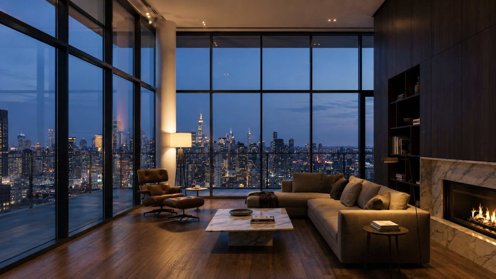
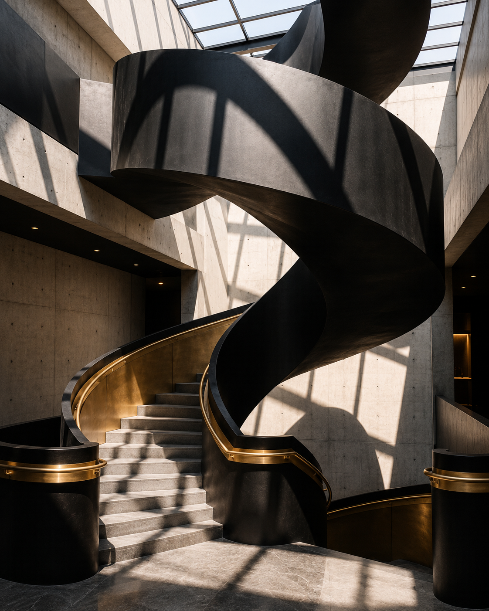
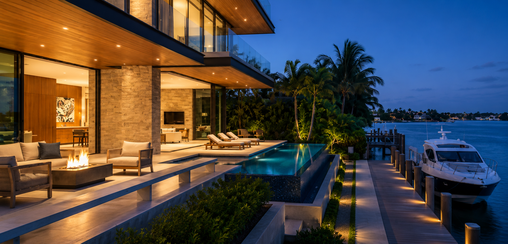
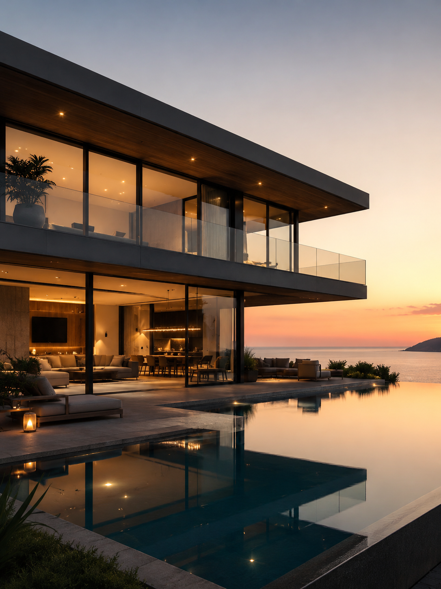
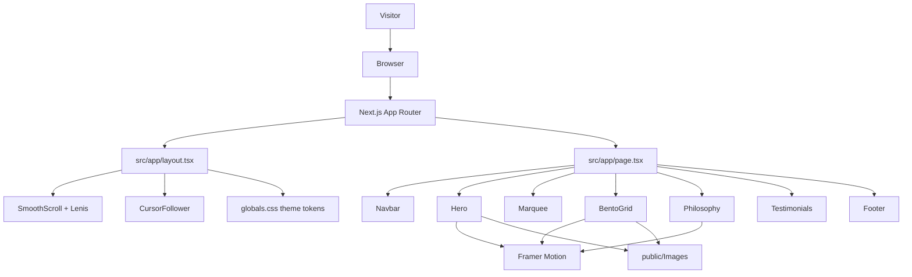

# Lumina

<p align="center">
  
</p>

<p align="center">
  A cinematic luxury real estate showcase built with Next.js, Tailwind CSS, Framer Motion, and Lenis.
</p>

<p align="center">
  <a href="https://github.com/EternalWorksX/Lumina">
    
  </a>
  
  
  
</p>


## Experience

Lumina is a premium real estate front-end focused on atmosphere, movement, and editorial presentation. The interface combines a dramatic hero composition, kinetic typography, smooth momentum scrolling, hover-revealed property cards, and a luxury black-and-gold design system.

The current site flow is intentionally lean:

- `Navbar` keeps navigation fixed and glassy as the page scrolls.
- `Hero` introduces the brand with staggered animated text and a parallax building visual.
- `Marquee` adds a continuous credibility strip for project and brand signals.
- `BentoGrid` presents featured residences in a responsive image grid.
- `Philosophy` pairs brand copy with an animated architectural blueprint.
- `Testimonials` and `Footer` close the experience with social proof and contact cues.

## Property Grid

<table>
  <tr>
    <td width="50%">
      
      <strong>Azure Coast Estate</strong><br />
      <sub>Oceanfront glass, horizon-led composition, portfolio hero card.</sub>
    </td>
    <td width="50%">
      
      <strong>Skyline Penthouse</strong><br />
      <sub>Vertical luxury, city-scale drama, tall bento presentation.</sub>
    </td>
  </tr>
  <tr>
    <td width="50%">
      
      <strong>Emerald Bay Villa</strong><br />
      <sub>Wide cinematic showcase with hover-revealed calls to action.</sub>
    </td>
    <td width="50%">
      
      <strong>Hero Residence</strong><br />
      <sub>Parallax building visual used in the first viewport.</sub>
    </td>
  </tr>
</table>

## Motion System

Lumina uses movement as part of the product language, not decoration.

- Animated headline sequencing through Framer Motion variants.
- Scroll-triggered reveal blocks through the shared `FadeIn` component.
- Parallax hero image movement from `useScroll` and `useTransform`.
- Pointer-responsive 3D hero tilt for a premium, gallery-like feel.
- Infinite marquee animation for brand metrics and positioning.
- Hover zoom, gradient overlays, and content reveal states for property cards.
- Custom cursor follower that appears over bento project cards.
- Animated SVG blueprint in the philosophy section.
- CSS `text-shimmer` utility for luminous animated typography.

## Architecture



## Tech Stack

| Layer | Choice |
| --- | --- |
| Framework | Next.js 16 with App Router |
| Language | TypeScript |
| Styling | Tailwind CSS v4 theme tokens in `globals.css` |
| Animation | Framer Motion, CSS keyframes, animated SVG |
| Scrolling | Lenis smooth scrolling |
| Fonts | `next/font/google` with Inter and Playfair Display |
| Assets | Static architectural imagery in `public/Images` |

## Project Structure

```text
Lumina
|-- docs/assets              # README preview GIF and animated wordmark
|-- public/Images            # Property and hero imagery
|-- src/app                  # App Router entry, metadata, global styles
|-- src/components           # Reusable interface and motion sections
|-- package.json             # Scripts and dependencies
`-- tsconfig.json            # TypeScript configuration
```

## Getting Started

Install dependencies:

```bash
npm install
```

Run the development server:

```bash
npm run dev
```

Open [http://localhost:3000](http://localhost:3000) to view Lumina locally.

Build for production:

```bash
npm run build
```

Run lint checks:

```bash
npm run lint
```

## Design Language

Lumina uses a restrained luxury palette and typography system:

| Token | Value | Use |
| --- | --- | --- |
| `--color-background` | `#050505` | Deep black cinematic base |
| `--color-primary` | `#f2ca50` | Gold accents and calls to action |
| `--color-on-surface` | `#eae1d4` | Primary text |
| `--color-on-surface-variant` | `#d0c5af` | Supporting copy |
| `--font-display-lg` | Playfair Display | Editorial headings |
| `--font-body-lg` | Inter | Readable product copy |

## License

This project is intended as a showcase. All rights reserved.
